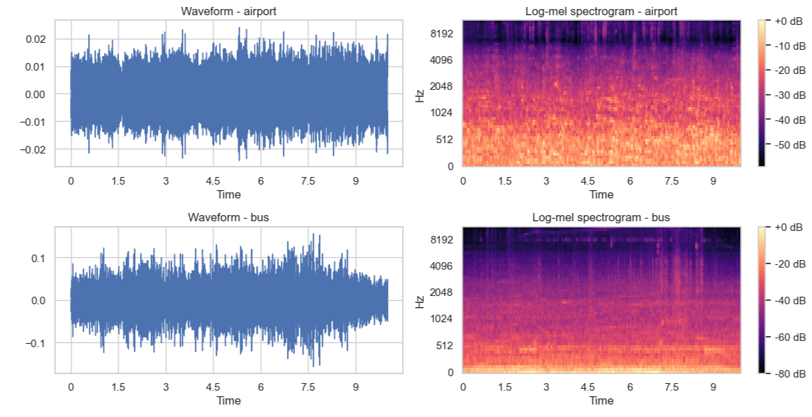
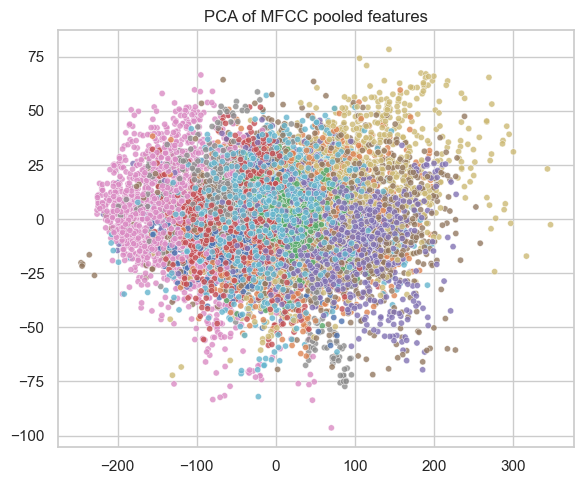

# Acoustic Scene Classification: Comparing SVM, Random Forest, and CRNN Models

**Authors:**  
Sang Hoon Chung, London Glenn, Keyanu Maloney, Hao Zhu  

*Department of Electrical & Computer Engineering, Texas A&M University*  

---

## Abstract

This project explores the task of acoustic scene classification using the TAU Urban Acoustic Scenes 2019 dataset, which encompasses ten diverse urban environments recorded across multiple cities and recording locations. A unified preprocessing pipeline was implemented, including resampling, amplitude normalization, log-mel spectrogram generation, and data augmentation to enhance robustness under real-world variability. Three modeling paradigms were examined—Support Vector Machines, Random Forests, and a Convolutional Recurrent Neural Network—each representing distinct approaches to audio feature representation and classification. Classical models operate on pooled log-mel statistics, whereas the CRNN processes full spectrograms to learn hierarchical time–frequency patterns. This comparative study highlights the representational trade-offs between feature-engineered methods and deep sequential architectures and provides a foundation for understanding how model complexity, data structure, and preprocessing choices influence performance in urban audio recognition tasks.
---

## Project Overview 
Acoustic scene classification (ASC) aims to assign semantic labels—such as park, metro, or shopping mall—to audio recordings that represent real-world urban environments. These classifications support a variety of applications, including context-aware mobile systems, environmental monitoring, and intelligent sensing in smart-city infrastructures.

This project evaluates three distinct modeling paradigms for ASC under a unified preprocessing and evaluation framework. The study investigates:

Support Vector Machines (SVMs) using pooled log-mel statistics

Random Forests (RFs) leveraging decision-tree ensembles

Convolutional Recurrent Neural Networks (CRNNs) that learn hierarchical time–frequency patterns directly from spectrograms

A comprehensive data preparation pipeline was designed to standardize inputs across models, incorporating resampling, amplitude normalization, log-mel spectrogram computation, and multiple forms of data augmentation. In addition, grouped train/validation/test splitting based on recording locations ensures realistic generalization by preventing location-level leakage.

The project aims not only to compare performance across classical and deep learning approaches but also to understand the trade-offs in representational capacity, interpretability, computational requirements, and robustness. Together, these analyses provide insight into how different modeling strategies respond to the structure of the TAU dataset and what implications this has for future work in urban audio recognition.

---
## Dataset Summary
This study utilizes the TAU Urban Acoustic Scenes 2019 (Development) dataset, which contains 10-second real-world audio recordings across 10 acoustic scene classes:

Airport

Bus

Metro

Metro station

Park

Public square

Shopping mall

Street, pedestrian

Street, traffic

Tram

The recordings were captured in multiple European cities (e.g., Barcelona, Helsinki, Lisbon, London, Lyon, Milan, Paris, Prague, Stockholm, Vienna) and across numerous distinct recording locations within each city. This multi-city, multi-location structure introduces rich environmental variability—making the classification task more realistic and challenging.

Each audio clip is provided at 44.1 kHz stereo, later transformed in this project to 22.05 kHz mono for consistency and computational efficiency. For classical models, pooled statistics (mean, standard deviation, percentiles) of log-mel spectrograms create fixed-length feature vectors. For deep learning models, full-resolution log-mel spectrograms are used directly.

The dataset also includes metadata identifying recording locations, enabling grouped splitting strategies that preserve class balance while preventing overlaps between training and test environments—an essential requirement for stable and fair evaluation.
---
### Audio Segments (Development Dataset)

| Scene class         | Segments | Barcelona | Helsinki | Lisbon | London | Lyon | Milan | Paris | Prague | Stockholm | Vienna |
|---------------------|----------|-----------|----------|--------|--------|------|-------|-------|--------|-----------|--------|
| Airport             | 1440     | 128       | 149      | 144    | 145    | 144  | 144   | 156   | 144    | 158       | 128    |
| Bus                 | 1440     | 144       | 144      | 144    | 144    | 144  | 144   | 144   | 144    | 144       | 144    |
| Metro               | 1440     | 141       | 144      | 144    | 146    | 144  | 144   | 144   | 144    | 145       | 144    |
| Metro station       | 1440     | 144       | 144      | 144    | 144    | 144  | 144   | 144   | 144    | 144       | 144    |
| Park                | 1440     | 144       | 144      | 144    | 144    | 144  | 144   | 144   | 144    | 144       | 144    |
| Public square       | 1440     | 144       | 144      | 144    | 144    | 144  | 144   | 144   | 144    | 144       | 144    |
| Shopping mall       | 1440     | 144       | 144      | 144    | 144    | 144  | 144   | 144   | 144    | 144       | 144    |
| Street, pedestrian  | 1440     | 145       | 145      | 144    | 145    | 144  | 144   | 144   | 144    | 145       | 140    |
| Street, traffic     | 1440     | 144       | 144      | 144    | 144    | 144  | 144   | 144   | 144    | 144       | 144    |
| Tram                | 1440     | 143       | 145      | 144    | 144    | 144  | 144   | 144   | 144    | 144       | 144    |
| **Total**           | **14400**| **1421**  | **1447** |**1440**|**1444**|**1440**|**1440**|**1452**|**1440**|**1456**  |**1420**|

---

### Audio Segments (Recording Locations)

| Scene class         | Locations | Barcelona | Helsinki | Lisbon | London | Lyon | Milan | Paris | Prague | Stockholm | Vienna |
|---------------------|-----------|-----------|----------|--------|--------|------|-------|-------|--------|-----------|--------|
| Airport             | 40        | 4         | 3        | 4      | 3      | 4    | 4     | 4     | 6      | 5         | 3      |
| Bus                 | 71        | 4         | 4        | 11     | 7      | 7    | 7     | 11    | 10     | 6         | 4      |
| Metro               | 67        | 3         | 5        | 11     | 4      | 9    | 8     | 9     | 10     | 4         | 4      |
| Metro station       | 57        | 5         | 6        | 4      | 12     | 5    | 4     | 9     | 4      | 4         | 4      |
| Park                | 41        | 4         | 4        | 4      | 4      | 4    | 4     | 4     | 4      | 5         | 4      |
| Public square       | 43        | 4         | 4        | 4      | 4      | 5    | 4     | 4     | 6      | 4         | 4      |
| Shopping mall       | 36        | 4         | 4        | 4      | 2      | 3    | 3     | 4     | 4      | 4         | 4      |
| Street, pedestrian  | 46        | 7         | 4        | 4      | 4      | 4    | 5     | 5     | 5      | 4         | 4      |
| Street, traffic     | 43        | 4         | 4        | 4      | 5      | 4    | 6     | 4     | 4      | 4         | 4      |
| Tram                | 70        | 4         | 4        | 6      | 9      | 7    | 11    | 9     | 11     | 5         | 4      |
| **Total**           | **514**   | **43**    | **42**   |**56**  |**54**  |**52**|**56** |**63** |**65**  |**45**     |**39**  |

---

## Data Processing

The TAU Urban Acoustic Scenes 2019 dataset consists of 10-second stereo audio clips recorded across multiple cities and locations. To ensure consistent and robust inputs, a unified data preparation pipeline was implemented as follows.

---

### 1. Audio Standardization

**Resampling & Channel Reduction**  
- All audio clips are resampled to **22.05 kHz** for efficiency.  
- Stereo recordings are converted to **mono** by channel averaging.

**Amplitude Normalization**  
- Each waveform is normalized to **zero mean and unit variance**, stabilizing training across models.

---

### 2. Time–Frequency Feature Construction

**Log-Mel Spectrograms**  
- Every clip is converted into a **128-bin log-mel spectrogram** with window and hop sizes chosen to fully cover the 10-second duration.  
- Log-mel scaling provides perceptual relevance and reduces sensitivity to amplitude variations.

**Pooled Feature Statistics (SVM & Random Forest)**  
- Classical models operate on fixed-length vectors derived from spectrogram statistics, including:  
  - Mean  
  - Standard deviation  
  - Selected percentiles  
- These features provide compact summaries of each clip's frequency–energy distribution.

**Full Spectrogram Input (CRNN)**  
- The CRNN consumes the entire log-mel spectrogram as a 2D time–frequency map.  
- Spectrograms are padded or trimmed to maintain a consistent input shape.

---

### 3. Data Augmentation

To improve robustness and limit overfitting, augmentation is applied during training.

**Waveform-Level Augmentations**  
- **Time shifting:** Circularly shift up to 10% of clip length  
- **Gain perturbation:** Apply small random amplitude scaling  
- **Additive noise:** Inject low-level Gaussian noise  

**Feature-Space Augmentation (Classical models)**  
- Add low-variance Gaussian noise to pooled feature vectors to create synthetic samples.

---

### 4. Grouped Dataset Splitting

To avoid location-level leakage and ensure realistic evaluation:

- Splitting is done **by recording location**, not individual clips.  
- Resulting distribution:  
  - **64% training**  
  - **16% validation**  
  - **20% testing**  
- This guarantees the test set contains **recordings from unseen environments**, improving generalization reliability.

---

### 5. Visualization and Diagnostic Analysis

**Waveform & Spectrogram Plots**  
- Example plots reveal differences in time–frequency energy patterns across scenes.

**PCA / t-SNE of Feature Space**  
- Pooled features projected to 2D show partial class clustering and overlap patterns, guiding expectations for model confusion behavior.

*Figure 1. Waveforms (left) and log-mel spectrograms (right) for various urban sound scenes.*

*Figure 2. PCA of MFCC pooled features for urban sound samples.*

---
## Model Description

This project evaluates three different modeling paradigms for acoustic scene classification: a Support Vector Machine (SVM), a Random Forest (RF), and a Convolutional Recurrent Neural Network (CRNN). Each model reflects a distinct approach to learning from audio features, ranging from classical machine learning to deep neural architectures.

---

### 1. Support Vector Machine (SVM)

The SVM operates on pooled log-mel statistical features extracted from each audio clip. These feature vectors combine the mean, standard deviation, and selected percentiles of the spectrogram to form a compact representation. An RBF kernel is used to capture non-linear class boundaries in this high-dimensional space.

**Key Characteristics**
- Uses **RBF kernel** for non-linear separation  
- Features standardized before training  
- Hyperparameters (**C**, **γ**) tuned via grid search  
- Performs **one-vs-rest multi-class classification**

SVMs provide stable optimization and strong performance when paired with well-engineered audio features.

---

### 2. Random Forest (RF)

The Random Forest classifier builds an ensemble of decision trees trained on bootstrap samples of the pooled log-mel feature vectors. Each tree explores different feature subsets, making the ensemble robust to noise and feature correlations.

**Key Characteristics**
- Hundreds of decision trees  
- Hyperparameters include:
  - Number of trees  
  - Maximum tree depth  
  - Features per split  
- Provides **feature importance**, enhancing interpretability  
- Naturally handles non-linear interactions

Random Forests trade off a small amount of accuracy for interpretability and robustness.

---

### 3. Convolutional Recurrent Neural Network (CRNN)

The CRNN processes the **full log-mel spectrogram** as a time–frequency image and learns hierarchical features directly from the data. It combines convolutional layers for local pattern extraction with a recurrent layer that models temporal dependencies.

**Architecture Overview**
- **3 convolutional blocks**  
  - 3×3 kernels  
  - Batch normalization  
  - ReLU activation  
  - 2×2 max-pooling  
- **LSTM layer** to model temporal structure  
- **Fully connected softmax layer** for classification  
- Optimized using **Adam** with cross-entropy loss  
- Early stopping applied based on validation accuracy

CRNNs are expressive and powerful but require more computation and careful tuning. They can underperform when training data is limited or when hyperparameters are not extensively optimized.

---

### 4. Metric-Learning Extension (CRNN Embeddings)

To explore the representational quality of the CRNN, the final softmax layer was removed and the penultimate LSTM output was used as a fixed-dimensional embedding. A **k-Nearest Neighbors (k-NN)** classifier was then trained on these embeddings.

**Key Insights**
- CRNN embeddings cluster similar scenes  
- k-NN on embeddings improves over the baseline CRNN classifier  
- Suggests suitability for **metric learning**, **few-shot learning**, and **representation learning**

This extension provides a promising direction for deeper research despite the CRNN underperforming in its baseline configuration.

---

### 5. The Research Extension

The metric-learning extension evaluates how well a simple distance-based classifier (k-NN) performs when applied to the embeddings extracted from the CRNN’s penultimate layer. This approach substantially improves the baseline CRNN softmax classifier, increasing the test accuracy from 48.25% → 52.08% and the macro-F1 score from 0.458 → 0.510.

Performance gains are consistent across several difficult scene classes. For example, the k-NN variant improves F1-scores to 0.45 on airport, 0.54 on bus, 0.51 on metro, and 0.78 on park, while maintaining strong results on street_traffic (F1 = 0.63). The macro-averaged precision, recall, and F1 for the k-NN system are approximately 0.51, 0.53, and 0.51, respectively.

These results indicate that although the CRNN’s softmax classifier underperforms relative to classical models, the embedding representation learned by the CRNN is structurally meaningful and useful for downstream classification. By replacing the final linear softmax layer with a simple k-NN classifier, the system recovers several percentage points of accuracy and macro-F1, narrowing the performance gap to the Random Forest model.

Overall, the study shows that SVM remains the strongest model, but RF and CRNN also provide competitive performance, with the CRNN’s embeddings in particular offering promise for metric-learning or few-shot extensions.

---

## Links

- **Dataset link:** https://soundata.readthedocs.io/en/stable/source/soundata.html#soundata.annotations.Tags
- **GitHub repository:** https://github.com/haozi672/ECEN-758-Project

